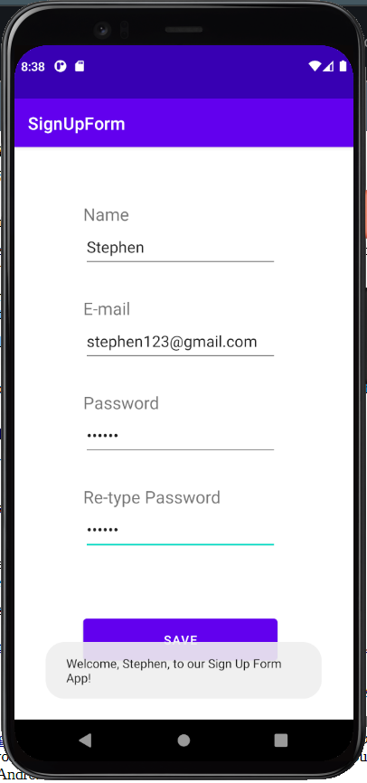

# Lab 2
Sign Up Form Application :: Introduction to Mobile Application Development

## Details:
First, an application will open containing text fields for name, email, and a password. 
When entering password, the app asks again for confirmation.
Once the application receives all required information above, the app welcomes the user by name to the application.
* In the event that the user misses at least one field, an error generates for the missing fields
* Similarly, if two passwords do not match before submission, an error message pops up to let the user know to try again. 

## Screenshots

## Previous Commits Made

* Total commits: 8
* Last commit: September 19
